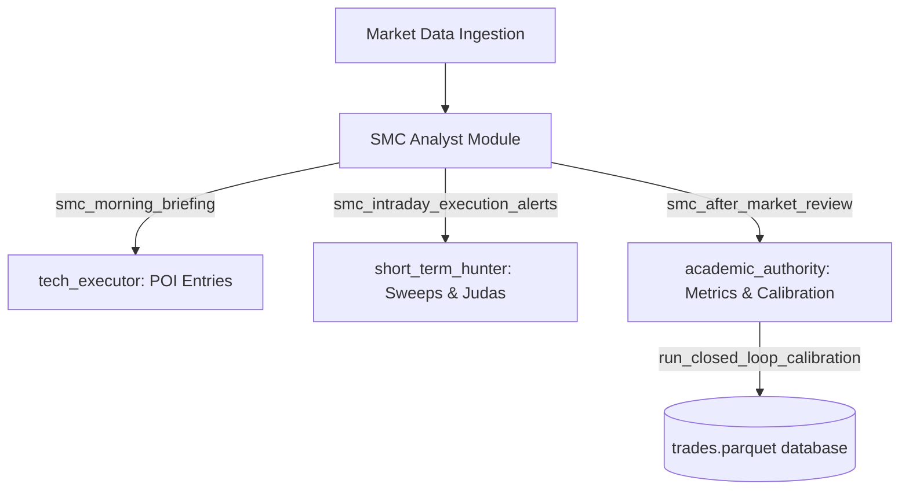

# SMC Quant Trading System: Agent Integration Hooks & API Guide (§18.7)

This document describes how the AI trading agent team roles (`tech_executor`, `short_term_hunter`, `institutional_analyst`, `academic_authority`) hook into and consume the outputs of the SMC Structure Analyst module.

---

## 1. Workflow Architecture & Entry Points

The SMC analyst functions act as hooks that are integrated directly into the trading agents' workflow loops (`daily_morning_briefing`, `intraday_execution`, `after_market_review`).



---

## 2. API Hook Details

### A. Morning Briefing Payload Hook
*   **Target Function:** `smc_morning_briefing(analyses: dict, institutional_net_buy: dict) -> dict`
*   **Consumer:** `tech_executor` & `institutional_analyst`
*   **Usage:** Called during the morning prep phase. Aggregates structural bias, optimal entry POIs, and cross-references them against Taiwan's Three Major Institutions' net flows to establish trade direction consensus.
*   **Payload Output Example:**
    ```json
    {
      "schema_version": 1,
      "workflow": "daily_morning_briefing",
      "rows": [
        {
          "symbol": "2330.TW",
          "bias": "bullish",
          "top_entry": {
            "model": "sweep_reversal",
            "direction": 1,
            "entry": 590.0,
            "stop": 585.0,
            "target": 610.0,
            "rr": 4.0,
            "score": 10
          },
          "inflow_xv": {
            "agreement": true,
            "dominant_institution": "foreign"
          }
        }
      ]
    }
    ```

### B. Intraday Alert Trigger Hook
*   **Target Function:** `smc_intraday_execution_alerts(analyses: dict) -> list[dict]`
*   **Consumer:** `short_term_hunter`
*   **Usage:** Fired every bar update. Detects when price triggers an HTF POI zone or triggers a Judas Swing session fakeout. Directs the hunter to immediately scan lower timeframes for entry execution confirmation.

### C. After-Market Performance & Self-Calibration Hook
*   **Target Function:** `smc_after_market_review(trade_records: list[dict], base_weights: dict) -> dict`
*   **Consumer:** `academic_authority`
*   **Usage:** Fired after market close or on a monthly schedule. Pulls settled trades from `trades.parquet` and performs Kelly criterion scaling, MAE/MFE stop-loss tuning, and Deflated Sharpe Ratio calculation to propose a calibrated `strategy.yaml`.
